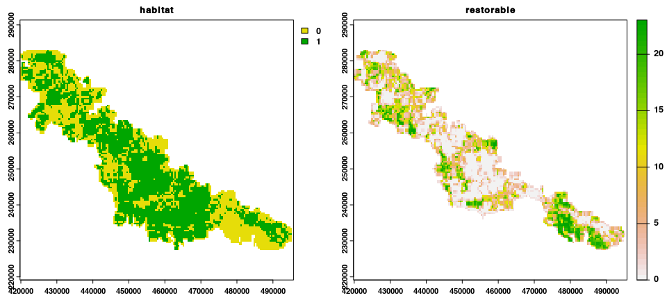
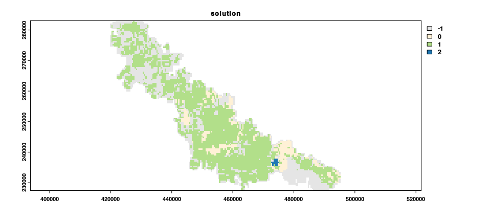

<!--- README.md is generated from README.Rmd. Please edit that file -->

## restopr: Interface to the ‘Restopt’ Ecological Restoration Planning Software

[](https://lifecycle.r-lib.org/articles/stages.html)
[](https://github.com/dimitri-justeau/restoptr/actions)
[](https://github.com/dimitri-justeau/restoptr/actions)
[](https://github.com/dimitri-justeau/restoptr/actions)
[](https://app.codecov.io/gh/dimitri-justeau/restoptr)
[](https://github.com/dimitri-justeau/restoptr)

## Overview

Interface to the `restopt` ecological restoration planning software,
which is specifically designed to identify connected, accessible, and
compact areas for ecological restoration, with an emphasis on reducing
habitat fragmentation and increasing habitat connectivity. This software
reproduces the methodology described in [this
article](https://www.researchgate.net/publication/346597935_Constrained_optimization_of_landscape_indices_in_conservation_planning_to_support_ecological_restoration_in_New_Caledonia),
and is based on Constraint Programming (CP), which is a constrained
optimization solving technique based on automated reasoning.
Specifically, our model was implemented using
[Choco-solver](https://choco-solver.org/), an open-source and
state-of-the-art Java CP solver.

## Installation

### Package installation

The latest developmental version of the *restoptr R* package can be
installed using the following *R* code.

``` r
if (!require(remotes)) install.packages("remotes")
remotes::install_github("dimitri-justeau/restoptr")
```

Or with *devtools*:

``` r
if (!require(devtools)) install.packages("devtools")
devtools::install_github("dimitri-justeau/rflsgen")
```

### System dependencies

The packages requires a Java Runtime Environment (JRE), version 8 or
higher. Below we provide platform-specific instructions to install it.

#### *Windows*

Please install the latest Java Development Kit from
[Oracle](www.oracle.com) website. To achieve this, navigate to the
[downloads section of the
website](https://www.oracle.com/java/technologies/javase-downloads.html),
select the tab for the Windows operating system, and then download the
x64 Installer file. After downloading the file, please run installer to
install Java on your system. You will also need to ensure that the
`PATH` environmental variable if configured so that *R* can access Java.
*restoptr* relies on *rJava* for the communication between *R* and
*Java*. If you have any trouble during the installation of *restopt* due
to *rJava*, please refer to *rJava*’s documentation:
<https://rforge.net/rJava/index.html>.

#### *Ubuntu*

For recent versions of Ubuntu (18.04 and later), the Java libraries are
available through official repositories. They can be installed using the
following system commands.

``` bash
sudo apt-get install default-jdk
```

If you want to install a specific JRE version, please follow
instructions from
[Oracle](https://www.oracle.com/java/technologies/javase-downloads.html),
or [OpenJDK](https://openjdk.java.net/install/).

#### *Linux*

Please follow instructions from
[Oracle](https://www.oracle.com/java/technologies/javase-downloads.html),
or [OpenJDK](https://openjdk.java.net/install/).

#### *MacOS*

The easiest way to install the Java libraries is using
[HomeBrew](https://brew.sh/). After installing HomeBrew, the Java
libraries can be installed using the following system commands.

``` bash
brew install openjdk
```

Please note that you might also need to ensure that the `PATH`
environmental variable if configured so that *R* can access Java.

## Citation

Please cite *restoptr* when using it in publications.

> Justeau-Allaire, D., Vieilledent, G., Rinck, N., Vismara, P., Lorca,
> X., & Birnbaum, P. (2021). Constrained optimization of landscape
> indices in conservation planning to support ecological restoration in
> New Caledonia. Journal of Applied Ecology, 58(4), 744‑754.

This article describes the methodology. We will provide a specific
citation for ressource the R package soon.

## Usage

The first thing to do to use *restoptr* is to load the package:

``` r
library(restoptr)
```

We will now create and solve a restoration optimization problem. Two
input rasters are necessary, the *existing_habitat* raster and the
*restorable_habitat* raster. **Important**: Both raster mus have the
same dimensions and the same spatial extent.

-   The *existing_habitat* raster indicates the habitat area (raster
    value 1), the non-habitat area (raster value 0), and area which is
    not part of the landscape (raster value NA, or NODATA, e.g. ocean if
    the landscape is terrestrial).

-   The *restorable_habitat* raster indicates the amount of habitat that
    can be restored for each planning unit (i.e. raster cells that are
    available for restoration, i.e. non-habitat).

Example rasters, from the use case presented in [this
study](https://www.researchgate.net/publication/346597935_Constrained_optimization_of_landscape_indices_in_conservation_planning_to_support_ecological_restoration_in_New_Caledonia)
are included in the package:

``` r
habitat_data <- rast(
  system.file("extdata", "habitat.tif", package = "restoptr")
)
restorable_data <- rast(
  system.file("extdata", "restorable.tif", package = "restoptr")
)
plot(rast(list(habitat_data, restorable_data)), nc = 2)
```



To instantiate a base restoration optimization problem from two input
rasters, use the `restopt_problem()` function:

``` r
p <- restopt_problem(existing_habitat = habitat_data, 
                     restorable_habitat = restorable_data) 
```

Then, we can add constraints to this base problem. For instance, lets
add a locked-out constraint, to restrict the number of planning units
that can be selected for restoration. Such a constraint can be used to
account for existing land-use practices, feasibility of restoration
activities, and stakeholder preferences.

``` r
locked_out_data <- rast(
 system.file("extdata", "locked-out.tif", package = "restoptr")
)
p <- p %>% add_locked_out_constraint(data = locked_out_data)
```

We can also add a constraint on the amount of restored area that is
allowed by the project:

``` r
p <- p %>% add_restorable_constraint(90, 220, 23)
```

And finally a compactness constraint, which limits the spatial extent of
the selected restoration area:

``` r
p <- p %>% add_compactness_constraint(5)
```

Once we have added constraints to the problem, we need to define an
optimization objective. For example, lets configure `restopr` to
identify, under the previous constraints, which restoration areas
maximises the effective mesh size (MESH).

``` r
p <- p %>% add_max_mesh_objective()
```

*Note* The effective mesh size is a measure of landscape fragmentation
based on the probability that two randomly chosen points are located in
the same patch [Jaeger, 2000](https://doi.org/10.1023/A:1008129329289).
Maximizing it in the context of restoration favours fewer and larger
patches.

Finally, we use the `solve()` function to identify the optimal
restoration area, according to the constraints and the optimization
objective.

``` r
s <- solve(p)
plot(
  x = s, main = "solution",
  col = c("#E5E5E5", "#fff1d6", "#b2df8a", "#1f78b4")
)
```



You can retrieve the attributes of the solution using the `attributes()`
function:

``` r
attributes(s)
```

    ## $ptr
    ## C++ object <0x55ea0a465a30> of class 'SpatRaster' <0x55ea02b1a490>
    ## 
    ## $class
    ## [1] "SpatRaster"
    ## attr(,"package")
    ## [1] "terra"
    ## 
    ## $metadata
    ##   Minimum.area.to.restore Maximum.restorable.area no..planning.units
    ## 1                     220                     219                 19
    ##   initial.MESH.value optimal.MESH.value solving.time..ms.
    ## 1           1035.435           1062.802              1381

## Getting help

If you have any questions about *restoptr*, improvement suggestions, or
if you detect a bug, please [open an
issue](https://github.com/dimitri-justeau/restoptr/issues/new/choose) in
this GitHub repository.
