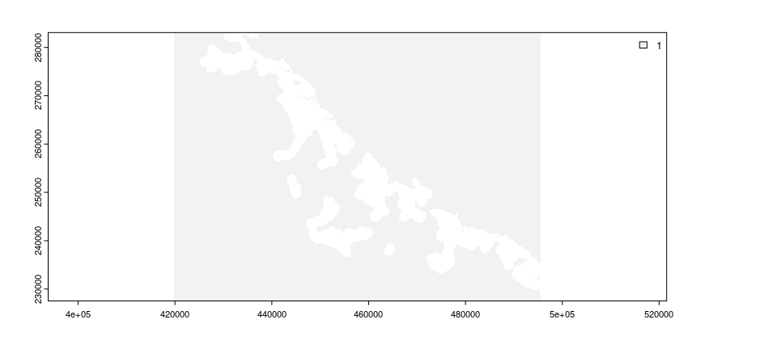
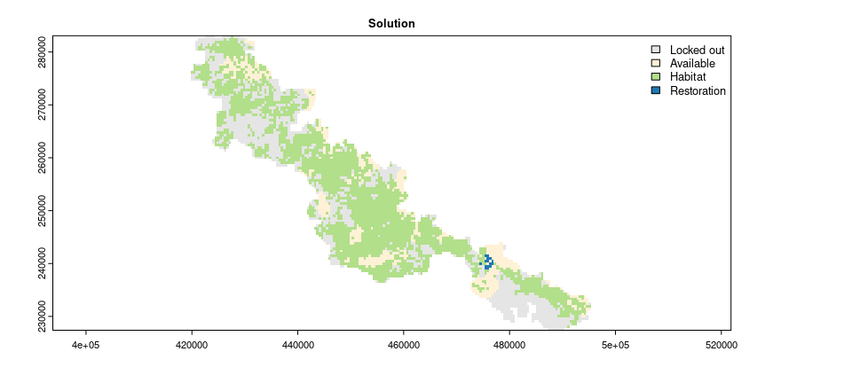

<!--- README.md is generated from README.Rmd. Please edit that file -->

# restopr: Ecological Restoration Planning

[](https://lifecycle.r-lib.org/articles/stages.html)
[](https://github.com/dimitri-justeau/restoptr/actions)
[](https://github.com/dimitri-justeau/restoptr/actions)
[](https://github.com/dimitri-justeau/restoptr/actions)
[](https://app.codecov.io/gh/dimitri-justeau/restoptr)
[](https://github.com/dimitri-justeau/restoptr)

## Overview

The `restoptr` R package provides a flexible framework for ecological
restoration planning. It aims to identify priority areas for restoration
efforts using optimization algorithms (based on Justeau-Allaire *et al.*
2021). Priority areas can be identified by maximizing landscape indices,
such as the effective mesh size (Jaeger 2000), or the integral index of
connectivity (Pascual-Hortal & Saura 2006). Additionally, constraints
can be used to ensure that priority areas exhibit particular
characteristics (e.g., ensure that particular places are not selected
for restoration, ensure that priority areas form a single contiguous
network). Furthermore, multiple near-optimal solutions can be generated
to explore multiple options in restoration planning. The package
leverages the [Choco-solver](https://choco-solver.org/) software to
perform optimization using constraint programming (CP) techniques
(Prud’homme *et al.* 2016).

## Installation

### Package installation

The latest official version of the *restoptr R* package can be installed
from the [Comprehensive R Archive Network
(CRAN)](https://cran.r-project.org/) using the following *R* code.

``` r
install.packages("restoptr", repos = "https://cran.rstudio.com/")
```

Alternatively, the latest developmental version can be installed using
the following *R* code. Please note that while developmental versions
may contain additional features not present in the official version,
they may also contain coding errors.

``` r
if (!require(remotes)) install.packages("remotes")
remotes::install_github("dimitri-justeau/restoptr")
```

### System dependencies

The packages requires a Java Runtime Environment (JRE), version 8 or
higher. Below we provide platform-specific instructions to install it.

#### *Windows*

Please install the latest Java Runtime Environment for Windows (see
Oracle JDK, [OpenJDK](https://openjdk.org/install/), or
[GraalVM](https://www.graalvm.org/downloads/)). You also need to install
[Maven](https://maven.apache.org/). After downloading the file, please
run installer to install Java on your system. You will also need to
ensure that the `PATH` environmental variable if configured so that *R*
can access Java. *restoptr* relies on *rJava* for the communication
between *R* and *Java*. If you have any trouble during the installation
of *restopt* due to *rJava*, please refer to *rJava*’s documentation:
<https://rforge.net/rJava/index.html>.

#### *Ubuntu*

For recent versions of Ubuntu (18.04 and later), the Java libraries are
available through official repositories. They can be installed using the
following system commands.

``` bash
sudo apt-get install default-jdk
```

If you want to install a specific JRE version, please follow
instructions from Oracle, [OpenJDK](https://openjdk.org/install/), or
[GraalVM](https://www.graalvm.org/downloads/).

#### *Linux*

Please follow instructions from Oracle,
[OpenJDK](https://openjdk.org/install/), or
[GraalVM](https://www.graalvm.org/downloads/).

#### *MacOS*

The easiest way to install the Java libraries is using
[HomeBrew](https://brew.sh/). After installing HomeBrew, the Java
libraries can be installed using the following system commands.

``` bash
brew install openjdk
```

Please note that you might also need to ensure that the `PATH`
environmental variable if configured so that *R* can access Java.

### Building the Java core library from source (optional)

The package relies on a core Java library called
[`restopt`](https://github.com/dimitri-justeau/restopt). This Java
library handles the constrained optimization process via the
[Choco-solver](https://choco-solver.org/) software. Although this
library is automatically included with the package, it can be manually
compile from source if needed. **Please note that this step is entirely
optional, and is not needed to install the package.** To compile the
Java library, a the [Maven](https://maven.apache.org/) software needs to
be installed as well as a Java Development Kit (JDK) (version 8+) is
required (e.g., see Oracle JDK, [OpenJDK](https://openjdk.org/install/),
or [GraalVM](https://www.graalvm.org/downloads/)). After installing
these dependencies, the following procedures can be used to compile the
Java library and it along with the package.

First clone the repository and update the source code.

``` bash
git clone https://github.com/dimitri-justeau/restoptr.git
cd restoptr
git submodule update --init --recursive
git pull --recurse-submodules
```

Next, compile the core Java library with Maven.

``` bash
cd restopt
mvn clean package -DskipTests
```

Next, copy the resulting Java library (.jar) file into `java` directory.

``` bash
cp target/restopt-*.jar ../java/
```

Finally, the package can be installed with the newly compiled Java
library using the following *R* command.

``` r
if (!require(remotes)) install.packages("remotes")
remotes::install_local(".")
```

## Usage

Here we will provide a short tutorial on using the *restoptr R* package
to identify priority areas for restoration. As part of this tutorial, we
will use an example dataset that is distributed with the package
(obtained from Justeau-Allaire *et al.* 2021). This example dataset
contains data for prioritizing forest restoration efforts within a
protected area in New Caledonia. We will begin the tutorial by loading
the package. If you haven’t already, please install the package (see
above for installation instructions).

``` r
# load package
library(restoptr)
```

To identify priorities for restoration, we require information on the
location of places that do and do not currently contain suitable
habitat. We will now import data to describe which places within the
protected area contain forest habitat (imported as the `habitat_data`
object). Specifically, this object is a spatial grid (i.e., raster
layer). Each grid cell corresponds to a candidate place for restoration
(termed planning unit), and their values indicate the absence or
presence of forest within each planning unit (using values of zero and
one, respectively).

``` r
# import data
habitat_data <- rast(
  system.file("extdata", "habitat_hi_res.tif", package = "restoptr")
)

# preview data
print(habitat_data)
```

    ## class       : SpatRaster 
    ## dimensions  : 1867, 2713, 1  (nrow, ncol, nlyr)
    ## resolution  : 27.9487, 29.74339  (x, y)
    ## extent      : 419768.2, 495593.1, 227538.9, 283069.8  (xmin, xmax, ymin, ymax)
    ## coord. ref. : RGNC91-93 / Lambert New Caledonia (EPSG:3163) 
    ## source      : habitat_hi_res.tif 
    ## name        : habitat_hi_res

``` r
# visualize data
plot(habitat_data, plg = list(x = "topright"))
```


Restoration efforts are often limited in terms of the places where they
can be implemented. For example, restoration efforts may not be feasible
in dense cities. In our example, some places are not feasible for
restoration because they cannot be accessed by existing tracks within
the protected area. We will now import data to describe which places are
not feasible for restoration (imported as the `locked_out_data` object).
This object – similar to the habitat data – is a spatial grid. The grid
cell values in this object indicate which planning units should be
considered available for restoration or not (using values of zero and
one, respectively).

``` r
# import data
locked_out_data <- rast(
  system.file("extdata", "locked_out.tif", package = "restoptr")
)

# preview data
print(locked_out_data)
```

    ## class       : SpatRaster 
    ## dimensions  : 1867, 2713, 1  (nrow, ncol, nlyr)
    ## resolution  : 27.9487, 29.74339  (x, y)
    ## extent      : 419768.2, 495593.1, 227538.9, 283069.8  (xmin, xmax, ymin, ymax)
    ## coord. ref. : RGNC91-93 / Lambert New Caledonia (EPSG:3163) 
    ## source      : locked_out.tif 
    ## name        : layer 
    ## min value   :     1 
    ## max value   :     1

``` r
# visualize data
plot(locked_out_data, plg = list(x = "topright"))
```



We now will build a restoration optimization problem (stored in the
`problem` object). This object will specify all the data, settings, and
optimization criteria for identifying priority areas. Specifically, we
will initialize the problem with the `habitat_data` object to specify
which planning units already contain suitable habitat (with the
`restopt_problem()` function). To reduce run time, we will also
initialize it with parameters to aggregate the spatial data (i.e.,
`aggregation_factor` and `habitat_threshold`). Next, we will specify
that the objective function for the optimization process is to maximize
connectivity based on the effective mesh size metric (with the
`set_max_mesh_objective()` function). We will then specify constraints
to ensure that the priority areas exhibit particular characteristics.
These constraints will be used to ensure that (i) certain planning units
are not selected for restoration (with the `add_locked_out_constraint()`
function), (ii) the total amount of restored area should range between
90 and 220 ha (with the `add_restorable_constraint()` function), and
(iii) limit the spatial extent of the priority areas to be within 2.4 km
(with the `add_compactness_constraint()` function).

``` r
# build restoration optimization problem
problem <-
  ## initialize problem with habitat data
  restopt_problem(
    existing_habitat = habitat_data,
    aggregation_factor = 16,
    habitat_threshold = 0.7
  ) %>%
  ## set objective function is to maximize effective mesh size
  set_max_mesh_objective() %>%
  ## add constraint to ensure that certain places are not selected
  add_locked_out_constraint(locked_out_data) %>%
  ## add constraint to limit total amount of restored area
  add_restorable_constraint(90, 220, unit = "ha") %>%
  ## add constraint to limit spatial extent of priority areas
  add_compactness_constraint(2.4, unit = "km")

# preview problem
print(problem)
```

    ## ----------------------------------------------------------------- 
    ##                          Restopt                          
    ## ----------------------------------------------------------------- 
    ## original habitat:     habitat_hi_res.tif 
    ## aggregation factor:   16 
    ## habitat threshold:    0.7 
    ## existing habitat:     in memory 
    ## restorable habitat:   in memory 
    ## ----------------------------------------------------------------- 
    ## objective:            Maximize effective mesh size 
    ## ----------------------------------------------------------------- 
    ## constraints:          
    ##   -  locked out (data = in memory) 
    ##   -  restorable (min_restore = 90, max_restore = 220, min_proportion = 1, unit = ha) 
    ##   -  compactness (max_diameter = 2.4, unit = km) 
    ## ----------------------------------------------------------------- 
    ## settings: 
    ##   - precision = 4
    ##   - time_limit = 0
    ##   - nb_solutions = 1
    ##   - optimality_gap = 0 
    ## -----------------------------------------------------------------

After building the problem, we can solve it to identify priority areas
for restoration (with the `solve()` function). The solution is a raster
layer containing values that indicate if planning units: (`0`) were
locked out, (`1`) do not contain existing habitat, (`2`) contain
existing habitat, or (`3`) selected as a priority area for restoration.

``` r
# solve problem to identify priority areas
solution <- solve(problem)
```

    ## Good news: the solver found 1 solution statisfying the constraints that was proven optimal ! (solving time = 0.93 s)

``` r
# preview solution
print(solution)
```

    ## class       : RestoptSolution 
    ## dimensions  : 117, 170, 1  (nrow, ncol, nlyr)
    ## resolution  : 447.1792, 475.8943  (x, y)
    ## extent      : 419768.2, 495788.7, 227390.1, 283069.8  (xmin, xmax, ymin, ymax)
    ## coord. ref. : RGNC91-93 / Lambert New Caledonia (EPSG:3163) 
    ## source      : memory 
    ## name        :  Solution 1 
    ## min value   :  Locked out 
    ## max value   : Restoration

``` r
# visualize solution
plot(
  solution,
  main = "Solution",
  col = c("#E5E5E5", "#fff1d6", "#b2df8a", "#1f78b4"),
  plg = list(x = "topright")
)
```



Finally, we can access additional information on the solution (with the
`get_metadata()` function).

``` r
# access information on the solution
## N.B. spatial units are expressed as hectares
get_metadata(solution, area_unit = "ha")
```

    ##     min_restore total_restorable nb_planning_units nb_components     diameter
    ## 1 219.3772 [ha]    219.3772 [ha]                15             3 2280.175 [m]
    ##   optimality_proven search_state solving_time  mesh_initial          mesh
    ## 1              TRUE   TERMINATED        0.916 13667.84 [ha] 14232.66 [ha]
    ##       mesh_best
    ## 1 14232.66 [ha]

This has just been a short taster of the package. For an extended
tutorial on using the package, please refer to the vignette.

## Citation

Please cite the *restoptr R* package when using it in publications.
Although a new publication describing the package is in preparation; in
the meantime, please use the following citation which outlines the
methodology.

> Justeau-Allaire, D., Vieilledent, G., Rinck, N., Vismara, P., Lorca,
> X., & Birnbaum, P. (2021). Constrained optimization of landscape
> indices in conservation planning to support ecological restoration in
> New Caledonia. Journal of Applied Ecology, 58(4), 744‑754.

## Getting help

If you have any questions about using the package, suggestions for
improvements, or if you detect a bug, please [open an issue in online
code
repository](https://github.com/dimitri-justeau/restoptr/issues/new/choose).
We designed the package to make it relatively easy to add new
functionality, and would be delighted to hear from you.

## References

Jaeger, J. A. G. (2000). Landscape division, splitting index, and
effective mesh size: New measures of landscape fragmentation. *Landscape
Ecology*, 15(2), 115-‑130.

Justeau-Allaire, D., Vieilledent, G., Rinck, N., Vismara, P., Lorca, X.,
& Birnbaum, P. (2021). Constrained optimization of landscape indices in
conservation planning to support ecological restoration in New
Caledonia. *Journal of Applied Ecology*, 58(4), 744‑-754.

Pascual-Hortal, L., & Saura, S. (2006). Comparison and development of
new graph-based landscape connectivity indices: Towards the priorization
of habitat patches and corridors for conservation. *Landscape Ecology*,
21(7), 959-‑967.

Prud’homme, C., Fages, J.-G., & Lorca, X. (2016). Choco Solver
Documentation. {TASC, INRIA Rennes, LINA CNRS UMR 6241, COSLING S.A.S.
Available at <https://choco-solver.org/>.
